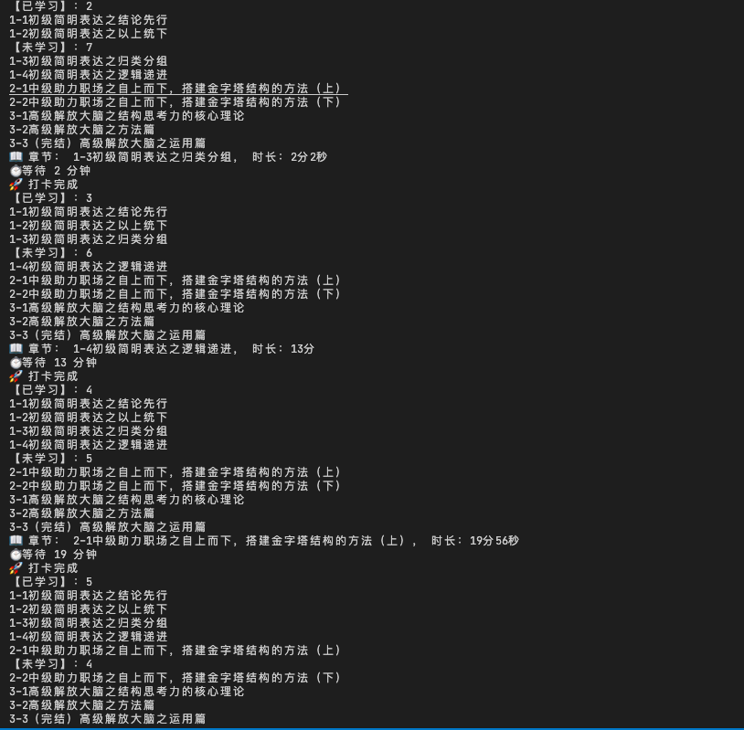
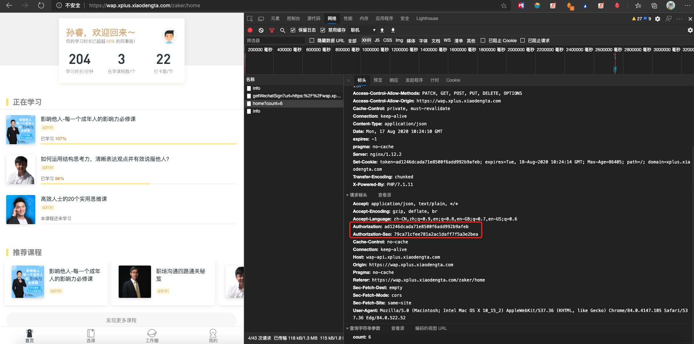

# 🚌 滴~公交卡

## 效果

## 准备

1. 保证nodejs已安装，（12.x已测试）

2. 项目根目录中运行 `npm install` 进行依赖的安装

3. 项目中config.js.tpl 改名为 config.js

## 步骤

1. 在电脑上进行登录(在微信中复制链接)

2. 进入首页，右键打开”检查“，找出Authorization和Authorization-Sso字段，并填写在config.js中

3. 填写好打卡评论的内容，字段为commentText

4. 填写好课程id，课程id在课程详情页的url获取

5. 运行`node index.js`即可

## 🎵 课程mp3下载

1. 填写好config.js 的配置

2. 运行`node download.js`，mp3在course目录下